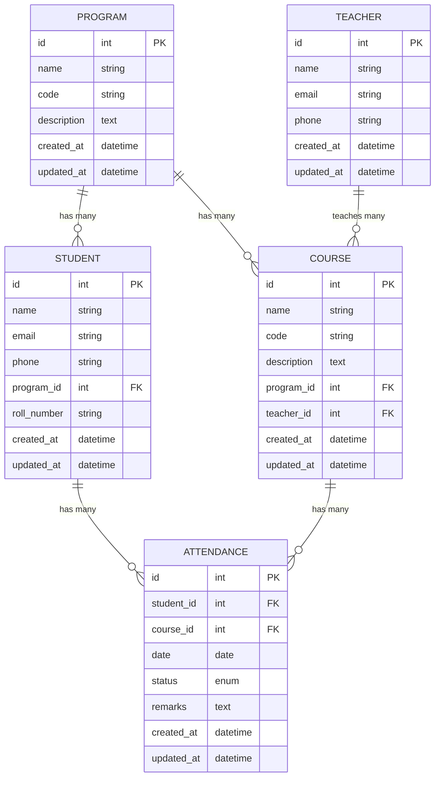

# Laravel School Attendance Management System

This guide walks through creating a School Attendance Management System as a RESTful API in Laravel. This project is designed for high school students learning Laravel fundamentals.

## Project Setup
# School Attendance Management System - ERD & Relationships

## Entity Relationship Diagram



## Relationship Cardinality Explanation

In this ERD, we have several relationships with different cardinalities:

### One-to-Many Relationships (1:N)

1. **Program to Students** (1:N)
   - One Program can have many Students
   - Each Student belongs to exactly one Program

2. **Program to Courses** (1:N)
   - One Program can have many Courses
   - Each Course belongs to exactly one Program

3. **Teacher to Courses** (1:N)
   - One Teacher can teach many Courses
   - Each Course is taught by exactly one Teacher

4. **Student to Attendances** (1:N)
   - One Student can have many Attendance records
   - Each Attendance record belongs to exactly one Student

5. **Course to Attendances** (1:N)
   - One Course can have many Attendance records
   - Each Attendance record belongs to exactly one Course

## Implementing One-to-Many Relationships in Laravel

### Database Migration Setup

When creating migrations in Laravel, we use foreign key constraints to establish relationships:

```php
// In the create_students_table migration
Schema::create('students', function (Blueprint $table) {
    $table->id();
    $table->string('name');
    $table->string('email')->unique();
    $table->string('phone')->nullable();
    $table->foreignId('program_id')->constrained()->onDelete('cascade');
    $table->string('roll_number')->unique();
    $table->timestamps();
});
```

The `foreignId('program_id')->constrained()` method creates a foreign key that references the id column on the programs table. The `onDelete('cascade')` means that if a program is deleted, all its students will be deleted as well.

### Model Relationships

In Laravel, we define relationships in the Eloquent models. Here's how to implement each of our relationships:

#### 1. Program to Students (1:N)

In the Program model:
```php
// Program.php
public function students()
{
    return $this->hasMany(Student::class);
}
```

In the Student model:
```php
// Student.php
public function program()
{
    return $this->belongsTo(Program::class);
}
```

#### 2. Program to Courses (1:N)

In the Program model:
```php
// Program.php
public function courses()
{
    return $this->hasMany(Course::class);
}
```

In the Course model:
```php
// Course.php
public function program()
{
    return $this->belongsTo(Program::class);
}
```

#### 3. Teacher to Courses (1:N)

In the Teacher model:
```php
// Teacher.php
public function courses()
{
    return $this->hasMany(Course::class);
}
```

In the Course model:
```php
// Course.php
public function teacher()
{
    return $this->belongsTo(Teacher::class);
}
```

#### 4. Student to Attendances (1:N)

In the Student model:
```php
// Student.php
public function attendances()
{
    return $this->hasMany(Attendance::class);
}
```

In the Attendance model:
```php
// Attendance.php
public function student()
{
    return $this->belongsTo(Student::class);
}
```

#### 5. Course to Attendances (1:N)

In the Course model:
```php
// Course.php
public function attendances()
{
    return $this->hasMany(Attendance::class);
}
```

In the Attendance model:
```php
// Attendance.php
public function course()
{
    return $this->belongsTo(Course::class);
}
```

## Using the Relationships in Laravel

### Fetching Related Data

#### Get all students in a program:
```php
$program = Program::find(1);
$students = $program->students; // Collection of Student models
```

#### Get a student's program:
```php
$student = Student::find(1);
$program = $student->program; // Program model
```

#### Get all courses taught by a teacher:
```php
$teacher = Teacher::find(1);
$courses = $teacher->courses; // Collection of Course models
```

#### Get all attendances for a student:
```php
$student = Student::find(1);
$attendances = $student->attendances; // Collection of Attendance models
```

### Creating Related Records

#### Create a new student for a program:
```php
$program = Program::find(1);
$student = $program->students()->create([
    'name' => 'John Doe',
    'email' => 'john@example.com',
    'phone' => '1234567890',
    'roll_number' => 'ST12345',
]);
```

#### Create a new attendance record for a student and course:
```php
$student = Student::find(1);
$attendance = $student->attendances()->create([
    'course_id' => 1,
    'date' => now(),
    'status' => 'present',
]);
```

### Querying with Relationships

#### Find all students in a specific program:
```php
$students = Student::where('program_id', 1)->get();
```

#### Find all courses a student is enrolled in (assuming a many-to-many relationship with a pivot table):
```php
$student = Student::find(1);
$courses = $student->courses; // If you have a many-to-many relationship
```

#### Find all attendance records for a specific course:
```php
$attendances = Attendance::where('course_id', 1)->get();
```

#### Find all students who were present on a specific date:
```php
$date = '2023-05-15';
$presentStudents = Student::whereHas('attendances', function ($query) use ($date) {
    $query->where('date', $date)->where('status', 'present');
})->get();
```

## Eager Loading to Prevent N+1 Problem

When dealing with relationships, it's important to use eager loading to prevent the N+1 query problem. For example:

```php
// Without eager loading - will result in N+1 queries
$students = Student::all();
foreach ($students as $student) {
    echo $student->program->name; // Each access causes a new query
}

// With eager loading - only 2 queries
$students = Student::with('program')->get();
foreach ($students as $student) {
    echo $student->program->name; // No additional queries
}
```

## Creating Records with Relationships

### Creating a new student with program relationship:

```php
$student = Student::create([
    'name' => 'Jane Smith',
    'email' => 'jane@example.com',
    'phone' => '9876543210',
    'program_id' => 1, // This establishes the relationship
    'roll_number' => 'ST67890',
]);
```

### Creating a new course with program and teacher relationships:

```php
$course = Course::create([
    'name' => 'Introduction to Programming',
    'code' => 'CSC101',
    'description' => 'Basic programming concepts',
    'program_id' => 1, // This establishes the relationship with Program
    'teacher_id' => 1, // This establishes the relationship with Teacher
]);
```

### Creating an attendance record with student and course relationships:

```php
$attendance = Attendance::create([
    'student_id' => 1, // This establishes the relationship with Student
    'course_id' => 1, // This establishes the relationship with Course
    'date' => now(),
    'status' => 'present',
    'remarks' => 'Participated actively',
]);
```

## Summary

In this document, we've explored the entity relationships in the School Attendance Management System. The system primarily uses one-to-many relationships, which are implemented in Laravel using the Eloquent ORM's `hasMany` and `belongsTo` methods.

By understanding these relationships, you can efficiently query and manipulate related data in your Laravel application, ensuring that your code is both clean and performant.
### Step 1: Install Laravel

First, install Laravel via Composer:

```bash
composer create-project laravel/laravel attendance-system
cd attendance-system
```

### Step 2: Database Configuration

Edit your `.env` file to set up your database connection:

```
DB_CONNECTION=mysql
DB_HOST=127.0.0.1
DB_PORT=3306
DB_DATABASE=attendance_system
DB_USERNAME=your_username
DB_PASSWORD=your_password
```

## Database Design

We'll create the following tables:
- Programs (e.g., "Computer Science", "Biology")
- Students (belongs to a program)
- Teachers
- Courses (belongs to a program, taught by a teacher)
- Attendances (tracks student attendance for course sessions)

## Creating Models, Migrations, and Relationships

### Step 3: Create Models with Relationships

Let's create the models and migrations all at once:

```bash
php artisan make:model Program -m
php artisan make:model Student -m
php artisan make:model Teacher -m
php artisan make:model Course -m
php artisan make:model Attendance -m
```

### Step 4: Define Migrations

Let's edit each migration file:

**programs table** (`database/migrations/xxxx_create_programs_table.php`):

```php
public function up()
{
    Schema::create('programs', function (Blueprint $table) {
        $table->id();
        $table->string('name');
        $table->string('code')->unique();
        $table->text('description')->nullable();
        $table->timestamps();
    });
}
```

**teachers table** (`database/migrations/xxxx_create_teachers_table.php`):

```php
public function up()
{
    Schema::create('teachers', function (Blueprint $table) {
        $table->id();
        $table->string('name');
        $table->string('email')->unique();
        $table->string('phone')->nullable();
        $table->timestamps();
    });
}
```

**students table** (`database/migrations/xxxx_create_students_table.php`):

```php
public function up()
{
    Schema::create('students', function (Blueprint $table) {
        $table->id();
        $table->string('name');
        $table->string('email')->unique();
        $table->string('phone')->nullable();
        $table->foreignId('program_id')->constrained()->onDelete('cascade');
        $table->string('roll_number')->unique();
        $table->timestamps();
    });
}
```

**courses table** (`database/migrations/xxxx_create_courses_table.php`):

```php
public function up()
{
    Schema::create('courses', function (Blueprint $table) {
        $table->id();
        $table->string('name');
        $table->string('code')->unique();
        $table->text('description')->nullable();
        $table->foreignId('program_id')->constrained()->onDelete('cascade');
        $table->foreignId('teacher_id')->constrained()->onDelete('cascade');
        $table->timestamps();
    });
}
```

**attendances table** (`database/migrations/xxxx_create_attendances_table.php`):

```php
public function up()
{
    Schema::create('attendances', function (Blueprint $table) {
        $table->id();
        $table->foreignId('student_id')->constrained()->onDelete('cascade');
        $table->foreignId('course_id')->constrained()->onDelete('cascade');
        $table->date('date');
        $table->enum('status', ['present', 'absent', 'late']);
        $table->text('remarks')->nullable();
        $table->timestamps();
        
        // Prevent duplicate attendance records
        $table->unique(['student_id', 'course_id', 'date']);
    });
}
```

### Step 5: Define Model Relationships

Now let's define the relationships in each model:

**Program Model** (`app/Models/Program.php`):

```php
<?php

namespace App\Models;

use Illuminate\Database\Eloquent\Factories\HasFactory;
use Illuminate\Database\Eloquent\Model;

class Program extends Model
{
    use HasFactory;
    
    protected $fillable = ['name', 'code', 'description'];
    
    public function students()
    {
        return $this->hasMany(Student::class);
    }
    
    public function courses()
    {
        return $this->hasMany(Course::class);
    }
}
```

**Teacher Model** (`app/Models/Teacher.php`):

```php
<?php

namespace App\Models;

use Illuminate\Database\Eloquent\Factories\HasFactory;
use Illuminate\Database\Eloquent\Model;

class Teacher extends Model
{
    use HasFactory;
    
    protected $fillable = ['name', 'email', 'phone'];
    
    public function courses()
    {
        return $this->hasMany(Course::class);
    }
}
```

**Student Model** (`app/Models/Student.php`):

```php
<?php

namespace App\Models;

use Illuminate\Database\Eloquent\Factories\HasFactory;
use Illuminate\Database\Eloquent\Model;

class Student extends Model
{
    use HasFactory;
    
    protected $fillable = ['name', 'email', 'phone', 'program_id', 'roll_number'];
    
    public function program()
    {
        return $this->belongsTo(Program::class);
    }
    
    public function attendances()
    {
        return $this->hasMany(Attendance::class);
    }
}
```

**Course Model** (`app/Models/Course.php`):

```php
<?php

namespace App\Models;

use Illuminate\Database\Eloquent\Factories\HasFactory;
use Illuminate\Database\Eloquent\Model;

class Course extends Model
{
    use HasFactory;
    
    protected $fillable = ['name', 'code', 'description', 'program_id', 'teacher_id'];
    
    public function program()
    {
        return $this->belongsTo(Program::class);
    }
    
    public function teacher()
    {
        return $this->belongsTo(Teacher::class);
    }
    
    public function attendances()
    {
        return $this->hasMany(Attendance::class);
    }
}
```

**Attendance Model** (`app/Models/Attendance.php`):

```php
<?php

namespace App\Models;

use Illuminate\Database\Eloquent\Factories\HasFactory;
use Illuminate\Database\Eloquent\Model;

class Attendance extends Model
{
    use HasFactory;
    
    protected $fillable = ['student_id', 'course_id', 'date', 'status', 'remarks'];
    
    public function student()
    {
        return $this->belongsTo(Student::class);
    }
    
    public function course()
    {
        return $this->belongsTo(Course::class);
    }
}
```

## Creating Factories and Seeders

### Step 6: Create Factories

Let's create factories to generate test data:

```bash
php artisan make:factory ProgramFactory
php artisan make:factory TeacherFactory
php artisan make:factory StudentFactory
php artisan make:factory CourseFactory
php artisan make:factory AttendanceFactory
```

Now let's implement each factory:

**ProgramFactory** (`database/factories/ProgramFactory.php`):

```php
<?php

namespace Database\Factories;

use App\Models\Program;
use Illuminate\Database\Eloquent\Factories\Factory;

class ProgramFactory extends Factory
{
    protected $model = Program::class;

    public function definition()
    {
        return [
            'name' => $this->faker->unique()->randomElement([
                'Computer Science', 'Biology', 'Mathematics', 
                'Physics', 'Chemistry', 'English Literature'
            ]),
            'code' => $this->faker->unique()->regexify('[A-Z]{3}[0-9]{3}'),
            'description' => $this->faker->paragraph(),
        ];
    }
}
```

**TeacherFactory** (`database/factories/TeacherFactory.php`):

```php
<?php

namespace Database\Factories;

use App\Models\Teacher;
use Illuminate\Database\Eloquent\Factories\Factory;

class TeacherFactory extends Factory
{
    protected $model = Teacher::class;

    public function definition()
    {
        return [
            'name' => $this->faker->name(),
            'email' => $this->faker->unique()->safeEmail(),
            'phone' => $this->faker->phoneNumber(),
        ];
    }
}
```

**StudentFactory** (`database/factories/StudentFactory.php`):

```php
<?php

namespace Database\Factories;

use App\Models\Program;
use App\Models\Student;
use Illuminate\Database\Eloquent\Factories\Factory;

class StudentFactory extends Factory
{
    protected $model = Student::class;

    public function definition()
    {
        return [
            'name' => $this->faker->name(),
            'email' => $this->faker->unique()->safeEmail(),
            'phone' => $this->faker->phoneNumber(),
            'program_id' => Program::factory(),
            'roll_number' => $this->faker->unique()->regexify('[A-Z]{2}[0-9]{6}'),
        ];
    }
}
```

**CourseFactory** (`database/factories/CourseFactory.php`):

```php
<?php

namespace Database\Factories;

use App\Models\Course;
use App\Models\Program;
use App\Models\Teacher;
use Illuminate\Database\Eloquent\Factories\Factory;

class CourseFactory extends Factory
{
    protected $model = Course::class;

    public function definition()
    {
        return [
            'name' => $this->faker->words(3, true),
            'code' => $this->faker->unique()->regexify('[A-Z]{3}[0-9]{3}'),
            'description' => $this->faker->paragraph(),
            'program_id' => Program::factory(),
            'teacher_id' => Teacher::factory(),
        ];
    }
}
```

**AttendanceFactory** (`database/factories/AttendanceFactory.php`):

```php
<?php

namespace Database\Factories;

use App\Models\Attendance;
use App\Models\Course;
use App\Models\Student;
use Illuminate\Database\Eloquent\Factories\Factory;

class AttendanceFactory extends Factory
{
    protected $model = Attendance::class;

    public function definition()
    {
        return [
            'student_id' => Student::factory(),
            'course_id' => Course::factory(),
            'date' => $this->faker->dateTimeBetween('-30 days', 'now'),
            'status' => $this->faker->randomElement(['present', 'absent', 'late']),
            'remarks' => $this->faker->optional(0.3)->sentence(),
        ];
    }
}
```

### Step 7: Create Database Seeders

```bash
php artisan make:seeder DatabaseSeeder
```

Let's implement the seeder:

**DatabaseSeeder** (`database/seeders/DatabaseSeeder.php`):

```php
<?php

namespace Database\Seeders;

use App\Models\Attendance;
use App\Models\Course;
use App\Models\Program;
use App\Models\Student;
use App\Models\Teacher;
use Illuminate\Database\Seeder;

class DatabaseSeeder extends Seeder
{
    public function run()
    {
        // Create 5 programs
        $programs = Program::factory(5)->create();
        
        // Create 10 teachers
        $teachers = Teacher::factory(10)->create();
        
        // Create 5 courses for each program with a random teacher
        $programs->each(function ($program) use ($teachers) {
            Course::factory(5)->create([
                'program_id' => $program->id,
                'teacher_id' => $teachers->random()->id,
            ]);
        });
        
        // Create 50 students across different programs
        $programs->each(function ($program) {
            Student::factory(10)->create([
                'program_id' => $program->id,
            ]);
        });
        
        // Create attendance records
        $students = Student::all();
        $courses = Course::all();
        
        // Create attendance for the last 30 days
        $dateRange = collect(range(0, 29))->map(function ($day) {
            return now()->subDays($day)->format('Y-m-d');
        });
        
        $students->each(function ($student) use ($courses, $dateRange) {
            // Get courses from student's program
            $programCourses = $courses->where('program_id', $student->program_id);
            
            // For each course and date, create an attendance record
            $programCourses->each(function ($course) use ($student, $dateRange) {
                $dateRange->each(function ($date) use ($student, $course) {
                    // Only create attendance for weekdays
                    $weekday = date('N', strtotime($date));
                    if ($weekday < 6) { // 1-5 are Monday to Friday
                        Attendance::create([
                            'student_id' => $student->id,
                            'course_id' => $course->id,
                            'date' => $date,
                            'status' => rand(1, 10) > 2 ? 'present' : (rand(0, 1) ? 'absent' : 'late'),
                            'remarks' => rand(1, 10) > 7 ? 'Some remarks about attendance' : null,
                        ]);
                    }
                });
            });
        });
    }
}
```

## Creating Controllers

### Step 8: Create API Controllers

```bash
php artisan make:controller Api/ProgramController --api
php artisan make:controller Api/TeacherController --api
php artisan make:controller Api/StudentController --api
php artisan make:controller Api/CourseController --api
php artisan make:controller Api/AttendanceController --api
```

Let's implement each controller:

**ProgramController** (`app/Http/Controllers/Api/ProgramController.php`):

```php
<?php

namespace App\Http\Controllers\Api;

use App\Http\Controllers\Controller;
use App\Models\Program;
use Illuminate\Http\Request;
use Illuminate\Support\Facades\Validator;

class ProgramController extends Controller
{
    public function index()
    {
        $programs = Program::with('courses')->get();
        return response()->json([
            'status' => 'success',
            'data' => $programs
        ]);
    }

    public function store(Request $request)
    {
        $validator = Validator::make($request->all(), [
            'name' => 'required|string|max:255',
            'code' => 'required|string|max:10|unique:programs',
            'description' => 'nullable|string',
        ]);

        if ($validator->fails()) {
            return response()->json([
                'status' => 'error',
                'errors' => $validator->errors()
            ], 422);
        }

        $program = Program::create($request->all());
        
        return response()->json([
            'status' => 'success',
            'message' => 'Program created successfully',
            'data' => $program
        ], 201);
    }

    public function show($id)
    {
        $program = Program::with(['courses', 'students'])->find($id);
        
        if (!$program) {
            return response()->json([
                'status' => 'error',
                'message' => 'Program not found'
            ], 404);
        }
        
        return response()->json([
            'status' => 'success',
            'data' => $program
        ]);
    }

    public function update(Request $request, $id)
    {
        $program = Program::find($id);
        
        if (!$program) {
            return response()->json([
                'status' => 'error',
                'message' => 'Program not found'
            ], 404);
        }
        
        $validator = Validator::make($request->all(), [
            'name' => 'required|string|max:255',
            'code' => 'required|string|max:10|unique:programs,code,' . $id,
            'description' => 'nullable|string',
        ]);

        if ($validator->fails()) {
            return response()->json([
                'status' => 'error',
                'errors' => $validator->errors()
            ], 422);
        }

        $program->update($request->all());
        
        return response()->json([
            'status' => 'success',
            'message' => 'Program updated successfully',
            'data' => $program
        ]);
    }

    public function destroy($id)
    {
        $program = Program::find($id);
        
        if (!$program) {
            return response()->json([
                'status' => 'error',
                'message' => 'Program not found'
            ], 404);
        }
        
        $program->delete();
        
        return response()->json([
            'status' => 'success',
            'message' => 'Program deleted successfully'
        ]);
    }
}
```

**TeacherController** (`app/Http/Controllers/Api/TeacherController.php`):

```php
<?php

namespace App\Http\Controllers\Api;

use App\Http\Controllers\Controller;
use App\Models\Teacher;
use Illuminate\Http\Request;
use Illuminate\Support\Facades\Validator;

class TeacherController extends Controller
{
    public function index()
    {
        $teachers = Teacher::with('courses')->get();
        return response()->json([
            'status' => 'success',
            'data' => $teachers
        ]);
    }

    public function store(Request $request)
    {
        $validator = Validator::make($request->all(), [
            'name' => 'required|string|max:255',
            'email' => 'required|email|unique:teachers',
            'phone' => 'nullable|string|max:20',
        ]);

        if ($validator->fails()) {
            return response()->json([
                'status' => 'error',
                'errors' => $validator->errors()
            ], 422);
        }

        $teacher = Teacher::create($request->all());
        
        return response()->json([
            'status' => 'success',
            'message' => 'Teacher created successfully',
            'data' => $teacher
        ], 201);
    }

    public function show($id)
    {
        $teacher = Teacher::with('courses')->find($id);
        
        if (!$teacher) {
            return response()->json([
                'status' => 'error',
                'message' => 'Teacher not found'
            ], 404);
        }
        
        return response()->json([
            'status' => 'success',
            'data' => $teacher
        ]);
    }

    public function update(Request $request, $id)
    {
        $teacher = Teacher::find($id);
        
        if (!$teacher) {
            return response()->json([
                'status' => 'error',
                'message' => 'Teacher not found'
            ], 404);
        }
        
        $validator = Validator::make($request->all(), [
            'name' => 'required|string|max:255',
            'email' => 'required|email|unique:teachers,email,' . $id,
            'phone' => 'nullable|string|max:20',
        ]);

        if ($validator->fails()) {
            return response()->json([
                'status' => 'error',
                'errors' => $validator->errors()
            ], 422);
        }

        $teacher->update($request->all());
        
        return response()->json([
            'status' => 'success',
            'message' => 'Teacher updated successfully',
            'data' => $teacher
        ]);
    }

    public function destroy($id)
    {
        $teacher = Teacher::find($id);
        
        if (!$teacher) {
            return response()->json([
                'status' => 'error',
                'message' => 'Teacher not found'
            ], 404);
        }
        
        $teacher->delete();
        
        return response()->json([
            'status' => 'success',
            'message' => 'Teacher deleted successfully'
        ]);
    }
}
```

**StudentController** (`app/Http/Controllers/Api/StudentController.php`):

```php
<?php

namespace App\Http\Controllers\Api;

use App\Http\Controllers\Controller;
use App\Models\Student;
use Illuminate\Http\Request;
use Illuminate\Support\Facades\Validator;

class StudentController extends Controller
{
    public function index()
    {
        $students = Student::with('program')->get();
        return response()->json([
            'status' => 'success',
            'data' => $students
        ]);
    }

    public function store(Request $request)
    {
        $validator = Validator::make($request->all(), [
            'name' => 'required|string|max:255',
            'email' => 'required|email|unique:students',
            'phone' => 'nullable|string|max:20',
            'program_id' => 'required|exists:programs,id',
            'roll_number' => 'required|string|max:20|unique:students',
        ]);

        if ($validator->fails()) {
            return response()->json([
                'status' => 'error',
                'errors' => $validator->errors()
            ], 422);
        }

        $student = Student::create($request->all());
        
        return response()->json([
            'status' => 'success',
            'message' => 'Student created successfully',
            'data' => $student
        ], 201);
    }

    public function show($id)
    {
        $student = Student::with(['program', 'attendances.course'])->find($id);
        
        if (!$student) {
            return response()->json([
                'status' => 'error',
                'message' => 'Student not found'
            ], 404);
        }
        
        return response()->json([
            'status' => 'success',
            'data' => $student
        ]);
    }

    public function update(Request $request, $id)
    {
        $student = Student::find($id);
        
        if (!$student) {
            return response()->json([
                'status' => 'error',
                'message' => 'Student not found'
            ], 404);
        }
        
        $validator = Validator::make($request->all(), [
            'name' => 'required|string|max:255',
            'email' => 'required|email|unique:students,email,' . $id,
            'phone' => 'nullable|string|max:20',
            'program_id' => 'required|exists:programs,id',
            'roll_number' => 'required|string|max:20|unique:students,roll_number,' . $id,
        ]);

        if ($validator->fails()) {
            return response()->json([
                'status' => 'error',
                'errors' => $validator->errors()
            ], 422);
        }

        $student->update($request->all());
        
        return response()->json([
            'status' => 'success',
            'message' => 'Student updated successfully',
            'data' => $student
        ]);
    }

    public function destroy($id)
    {
        $student = Student::find($id);
        
        if (!$student) {
            return response()->json([
                'status' => 'error',
                'message' => 'Student not found'
            ], 404);
        }
        
        $student->delete();
        
        return response()->json([
            'status' => 'success',
            'message' => 'Student deleted successfully'
        ]);
    }
}
```

**CourseController** (`app/Http/Controllers/Api/CourseController.php`):

```php
<?php

namespace App\Http\Controllers\Api;

use App\Http\Controllers\Controller;
use App\Models\Course;
use Illuminate\Http\Request;
use Illuminate\Support\Facades\Validator;

class CourseController extends Controller
{
    public function index()
    {
        $courses = Course::with(['program', 'teacher'])->get();
        return response()->json([
            'status' => 'success',
            'data' => $courses
        ]);
    }

    public function store(Request $request)
    {
        $validator = Validator::make($request->all(), [
            'name' => 'required|string|max:255',
            'code' => 'required|string|max:10|unique:courses',
            'description' => 'nullable|string',
            'program_id' => 'required|exists:programs,id',
            'teacher_id' => 'required|exists:teachers,id',
        ]);

        if ($validator->fails()) {
            return response()->json([
                'status' => 'error',
                'errors' => $validator->errors()
            ], 422);
        }

        $course = Course::create($request->all());
        
        return response()->json([
            'status' => 'success',
            'message' => 'Course created successfully',
            'data' => $course
        ], 201);
    }

    public function show($id)
    {
        $course = Course::with(['program', 'teacher', 'attendances.student'])->find($id);
        
        if (!$course) {
            return response()->json([
                'status' => 'error',
                'message' => 'Course not found'
            ], 404);
        }
        
        return response()->json([
            'status' => 'success',
            'data' => $course
        ]);
    }

    public function update(Request $request, $id)
    {
        $course = Course::find($id);
        
        if (!$course) {
            return response()->json([
                'status' => 'error',
                'message' => 'Course not found'
            ], 404);
        }
        
        $validator = Validator::make($request->all(), [
            'name' => 'required|string|max:255',
            'code' => 'required|string|max:10|unique:courses,code,' . $id,
            'description' => 'nullable|string',
            'program_id' => 'required|exists:programs,id',
            'teacher_id' => 'required|exists:teachers,id',
        ]);

        if ($validator->fails()) {
            return response()->json([
                'status' => 'error',
                'errors' => $validator->errors()
            ], 422);
        }

        $course->update($request->all());
        
        return response()->json([
            'status' => 'success',
            'message' => 'Course updated successfully',
            'data' => $course
        ]);
    }

    public function destroy($id)
    {
        $course = Course::find($id);
        
        if (!$course) {
            return response()->json([
                'status' => 'error',
                'message' => 'Course not found'
            ], 404);
        }
        
        $course->delete();
        
        return response()->json([
            'status' => 'success',
            'message' => 'Course deleted successfully'
        ]);
    }
}
```

**AttendanceController** (`app/Http/Controllers/Api/AttendanceController.php`):

```php
<?php

namespace App\Http\Controllers\Api;

use App\Http\Controllers\Controller;
use App\Models\Attendance;
use App\Models\Course;
use App\Models\Student;
use Illuminate\Http\Request;
use Illuminate\Support\Facades\Validator;

class AttendanceController extends Controller
{
    public function index()
    {
        $attendances = Attendance::with(['student', 'course'])->get();
        return response()->json([
            'status' => 'success',
            'data' => $attendances
        ]);
    }

    public function store(Request $request)
    {
        $validator = Validator::make($request->all(), [
            'student_id' => 'required|exists:students,id',
            'course_id' => 'required|exists:courses,id',
            'date' => 'required|date',
            'status' => 'required|in:present,absent,late',
            'remarks' => 'nullable|string',
        ]);

        if ($validator->fails()) {
            return response()->json([
                'status' => 'error',
                'errors' => $validator->errors()
            ], 422);
        }

        // Check if attendance already exists for this student, course, and date
        $exists = Attendance::where('student_id', $request->student_id)
            ->where('course_id', $request->course_id)
            ->where('date', $request->date)
            ->exists();
            
        if ($exists) {
            return response()->json([
                'status' => 'error',
                'message' => 'Attendance record already exists for this student, course, and date'
            ], 422);
        }

        $attendance = Attendance::create($request->all());
        
        return response()->json([
            'status' => 'success',
            'message' => 'Attendance recorded successfully',
            'data' => $attendance
        ], 201);
    }

    public function show($id)
    {
        $attendance = Attendance::with(['student', 'course'])->find($id);
        
        if (!$attendance) {
            return response()->json([
                'status' => 'error',
                'message' => 'Attendance record not found'
            ], 404);
        }
        
        return response()->json([
            'status' => 'success',
            'data' => $attendance
        ]);
    }

    public function update(Request $request, $id)
    {
        $attendance = Attendance::find($id);
        
        if (!$attendance) {
            return response()->json([
                'status' => 'error',
                'message' => 'Attendance record not found'
            ], 404);
        }
        
        $validator = Validator::make($request->all(), [
            'student_id' => 'required|exists:students,id',
            'course_id' => 'required|exists:courses,id',
            'date' => 'required|date',
            'status' => 'required|in:present,absent,late',
            'remarks' => 'nullable|string',
        ]);

        if ($validator->fails()) {
            return response()->json([
                'status' => 'error',
                'errors' => $validator->errors()
            ], 422);
        }

        // Check if updating would create a duplicate
        $exists = Attendance::where('student_id', $request->student_id)
            ->where('course_id', $request->course_id)
            ->where('date', $request->date)
            ->where('id', '!=', $id)